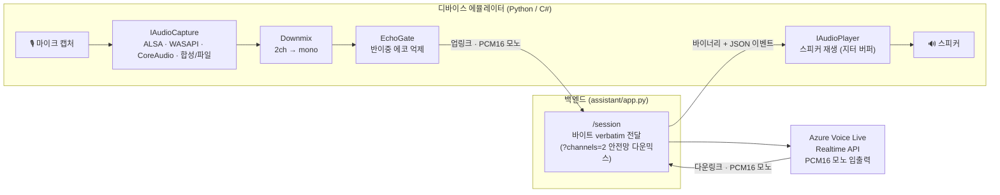
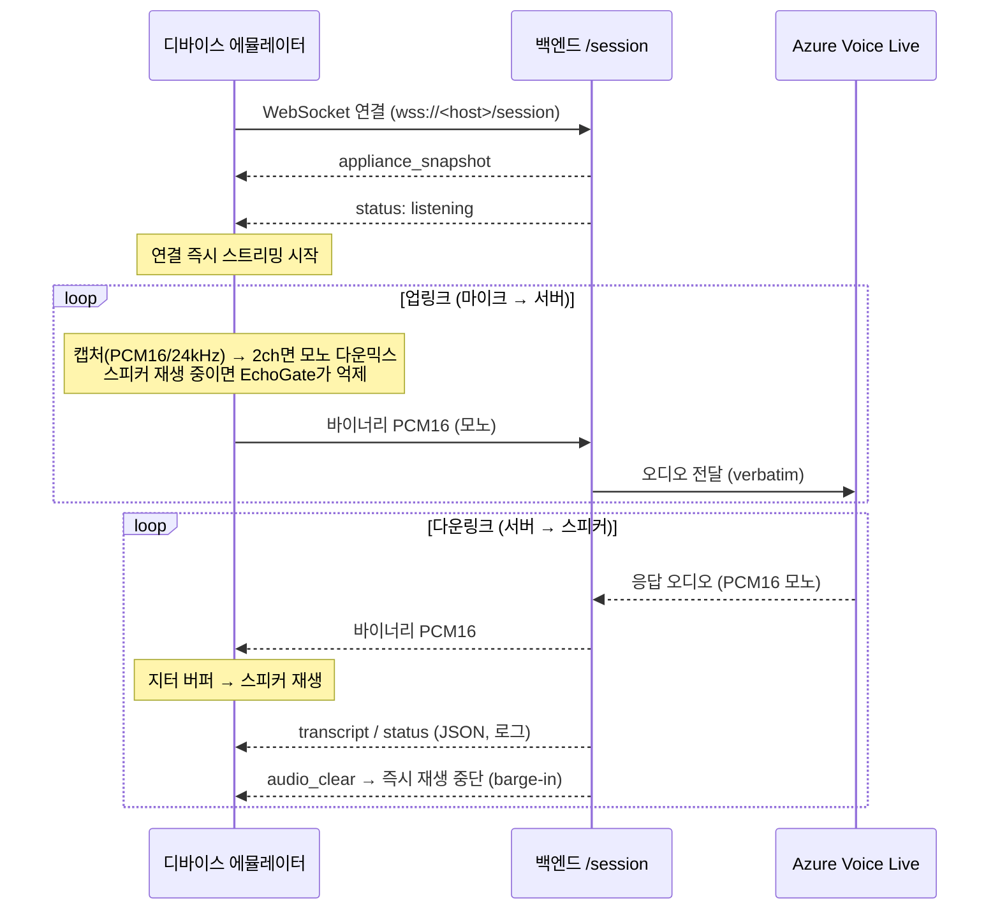

# ThinQ Voice Live 디바이스 에뮬레이터 (`devicesim/`)

LG전자 **ThinQ ON** 과 같은 “마이크 + 스피커만 있는” 헤드리스 디바이스를 에뮬레이션하여,
실제 하드웨어 확보 전에 **Azure Voice Live end-to-end 음성 경로**를 검증하기 위한 도구 모음입니다.
브라우저 프론트엔드(`/frontend`)가 하던 일 — 마이크 입력 → WSS 스트리밍 → 스피커 재생 — 을
화면 없이 그대로 재현합니다.

> 작성: **Microsoft Korea STU & GBB** · 대상: **LG전자 ThinQ AI 엔지니어**

---

## 구성

| 경로 | 내용 |
|------|------|
| [`python/`](python/) | Python CLI 에뮬레이터 (uv · asyncio). 레퍼런스/개발용. |
| [`csharp/`](csharp/) | C# 에뮬레이터 (.NET 8 · 네이티브 C 스타일). ARM Cortex-A53 + 2×MEMS 타깃 근접. |
| [`docs/`](docs/) | 한국어 기술 발표 자료 (`ThinQ-VoiceLive-DeviceSim-KR.pptx`). |
| [`ms_ref/`](ms_ref/) | Azure Voice Live 레퍼런스 코드(Python/C#). |

두 에뮬레이터는 **동일한 WSS 계약**을 공유합니다. 디바이스에는 마이크와 스피커만 존재한다는
전제이므로, WebSocket 연결과 동시에 오디오 스트리밍이 시작되고(핸드셰이크 불필요),
검증은 **스피커 재생**으로만 이루어집니다(화면 없음, 전사는 로그로만 확인).

---

## 아키텍처



- **IAudioCapture / IAudioPlayer** 추상화로 OS별 백엔드를 캡슐화합니다.
- 업링크 **와이어 포맷은 항상 모노 PCM16 / 24kHz** 입니다. 2채널 캡처는 전송 직전
  디바이스에서 모노로 다운믹스합니다. (자세한 근거는 아래 “왜 모노인가” 참조)
- 업링크/다운링크는 단일 WebSocket 위에서 **독립 루프로 병렬(full-duplex)** 처리됩니다.

---

## 데이터플로우



### WSS 계약 요약

| 방향 | 포맷 / 내용 |
|------|-------------|
| 업링크 | PCM16 / 24kHz / **모노** 바이너리 프레임 |
| 다운링크 (바이너리) | PCM16 / 24kHz / 모노 → 스피커 |
| 다운링크 (텍스트 JSON) | `appliance_snapshot`, `appliance_update`, `transcript`, `status`, `audio_clear` |
| 제어 (텍스트 JSON, 선택) | `send_text`, `stop_session` |

---

## OS 지원 매트릭스

| 플랫폼 | 오디오 백엔드 | 실제 HW I/O | 용도 |
|--------|---------------|-------------|------|
| Linux / ARM (Cortex-A53) | ALSA — `libasound` P/Invoke | ✅ | 타깃 디바이스 근접 |
| Windows | WASAPI — NAudio | ✅ | 개발 · 검증 |
| macOS | CoreAudio — AudioToolbox AudioQueue | ✅ | 개발 · 검증 |
| CI / 헤드리스 | Synthetic(합성) · File(파일) | ❌ | 자동화 테스트 |

- **자동 감지**: C# 은 `RuntimeInformation.IsOSPlatform`, Python 은 `platform` 모듈로 OS를 판별해
  백엔드를 선택합니다. 하드웨어가 없으면 합성/파일 백엔드로 자동 폴백합니다(CI 안전).
- `DEVICESIM_FORCE_SYNTHETIC=1` 로 합성 백엔드를 강제할 수 있습니다.

---

## 왜 모노(1채널) 업링크인가

> **결론: ThinQ ON 은 모노로 업링크해야 한다.**

1. **Voice Live 는 모노 전용** — `input_audio_format = PCM16`(모노). 채널 수 지정 필드가 없고,
   두 번째 채널을 노이즈 제거에 활용하지 못합니다.
2. **백엔드는 바이트를 그대로 전달** — `assistant/app.py` 의 `/session` 은 디바이스 바이트를
   verbatim 으로 Voice Live 에 전달합니다. 인터리브드 2채널을 그대로 보내면 모노 디코더가
   매 두 번째 샘플을 오해석 → **피치/속도 왜곡(오디오 깨짐)**.
3. **ThinQ ON 은 이미 온디바이스 처리** — HW AEC · 빔포밍 · 원거리 인식을 디바이스에서 수행하므로
   잡음 제거가 이미 끝난 상태입니다. 서버로 raw 2채널을 보낼 이유가 없습니다.

### “2채널”이 의미할 수 있는 것

| 탭(tap) 지점 | 두 채널의 구성 | Voice Live 에 유용한가 |
|--------------|----------------|------------------------|
| 원시 2×MEMS 마이크 | 두 채널 모두 음성 + 잡음(미처리) | ❌ 모노 디코더가 인터리브를 깨뜨림 |
| ANC / 참조 채널 | 주 채널 + 파생된 ‘잡음 전용’ 채널 | ❌ Realtime API 는 참조 채널 미지원 |
| DSP 후처리 출력 | 단일 정제(clean) 모노 스트림 | ✅ 우리가 실제로 보내는 것 |

- **2채널이 유용한 경우**: ‘저지능’ 디바이스 + **서버측** 마이크-어레이 처리(빔포밍)를 서버가
  수행할 때. → ThinQ ON 은 온디바이스 처리를 하므로 해당 없음.
- **구현**: 기본값 `--channels 1`(모노). `--channels 2` 는 2-마이크 어레이 캡처 후 전송 직전
  온디바이스에서 모노로 다운믹스. 백엔드 `app.py` 는 `?channels=2` 수신 시 서버측 다운믹스도
  지원(하위호환)하지만, **권장·구현 방식은 온디바이스 모노 다운믹스**입니다.

---

## 음향 에코(AEC) 처리

원시 PCM 을 다루는 CLI 에뮬레이터에는 AEC 파이프라인이 없어, 스피커 출력이 마이크로 재유입되면
에뮬레이터가 **자기 발화를 사용자 입력으로 오인식**하고 대화 시작 부분이 잘립니다.

| 환경 | AEC 유무 | 방식 |
|------|----------|------|
| 브라우저 프론트엔드 | 있음 | WebRTC AEC3 (`getUserMedia({ echoCancellation, noiseSuppression, autoGainControl })`) |
| CLI 에뮬레이터 | 없음(원시 PCM) | **소프트웨어 반이중(EchoGate)** 으로 우회 |
| ThinQ ON (실제) | 있음(하드웨어) | 전용 DSP/AEC · 빔포밍 · 원거리 인식(3–5m) |

- **EchoGate**: 스피커 재생 중 + 종료 후 **0.25초 hangover** 동안 마이크 업링크를 억제(반이중).
- `--allow-barge-in` 으로 비활성화 가능 — 하드웨어 AEC 가 있는 실제 ThinQ ON 에서는 완전
  이중(full-duplex) 대화를 활성화합니다.
- 요점: 에코는 “CLI 전용” 문제가 아니라 **“AEC 부재”** 문제입니다.

---

## 실행

각 에뮬레이터의 상세 실행 방법은 하위 README 를 참조하세요.

### C# 실행 전: .NET 8 설치 확인/설치

- C# 에뮬레이터(`devicesim/csharp`)는 **.NET 8 SDK**가 필요합니다.
- 먼저 설치 여부를 확인합니다.

```bash
dotnet --list-sdks
```

- 출력에 `8.0.xxx`가 있으면 추가 설치 없이 바로 실행 가능합니다.
- `8.0.xxx`가 없다면 OS별로 설치 후 다시 확인하세요.

#### Linux (x64 / ARM64)

```bash
# 배포판 정보 확인
cat /etc/os-release

# Ubuntu 계열: Microsoft 패키지 피드 등록
wget https://packages.microsoft.com/config/ubuntu/$(. /etc/os-release; echo $VERSION_ID)/packages-microsoft-prod.deb -O packages-microsoft-prod.deb
# Debian 계열은 ubuntu 대신 debian 사용:
# wget https://packages.microsoft.com/config/debian/$(. /etc/os-release; echo $VERSION_ID)/packages-microsoft-prod.deb -O packages-microsoft-prod.deb
sudo dpkg -i packages-microsoft-prod.deb
rm packages-microsoft-prod.deb

# .NET 8 SDK 설치
sudo apt-get update
sudo apt-get install -y dotnet-sdk-8.0

# 확인
dotnet --list-sdks
```

- ARM 보드(예: Cortex-A53)가 `arm64/aarch64`라면 위 방식으로 설치 가능합니다.
- `armv7`(32-bit) 환경은 .NET 8 SDK 지원이 제한될 수 있으므로 가능하면 64-bit OS(`arm64`) 사용을 권장합니다.
- RHEL/Fedora 계열 등 다른 배포판은 공식 가이드를 따르세요: https://learn.microsoft.com/dotnet/core/install/linux

#### macOS (Apple Silicon / Intel)

```bash
# Homebrew 사용 시
brew update
brew install --cask dotnet-sdk

# 확인
dotnet --list-sdks
```

- Apple Silicon(M1/M2/M3)과 Intel 모두 설치 가능하며, 설치 후 새 터미널에서 다시 확인하세요.
- Homebrew가 없다면 공식 설치 페이지를 사용하세요: https://dotnet.microsoft.com/download/dotnet/8.0

#### Windows

```powershell
# winget 사용 시
winget install Microsoft.DotNet.SDK.8

# 확인
dotnet --list-sdks
```

- 이미 Visual Studio 2022(최신)에서 .NET 8 워크로드를 설치했다면 추가 설치가 필요 없을 수 있습니다.
- winget을 사용하지 않으면 공식 설치 페이지를 사용하세요: https://dotnet.microsoft.com/download/dotnet/8.0

```bash
# Python (uv)
cd devicesim/python
uv run device-emulator --url https://ca-voicelive-fe.agreeablemushroom-8092c27a.koreacentral.azurecontainerapps.io

# C# (.NET 8)
cd devicesim/csharp
dotnet run -- --url https://ca-voicelive-fe.agreeablemushroom-8092c27a.koreacentral.azurecontainerapps.io
# 자체 서명 인증서(kukovm2:5173): --insecure 추가
```

- [`python/README.md`](python/README.md)
- [`csharp/README.md`](csharp/README.md)

---

## 검증

- 단위 테스트: **Python 108 · C# 24 통과** (TDD, 공개 인터페이스 seam 단위).
- 라이브 스모크: 두 프로덕션 URL(ACA · kukovm2:5173) 대상 실제 마이크·스피커 왕복 확인.
  `--channels 2` 스테레오 발화가 다운믹스 후 정상 인식(문맥에 맞는 도메인 응답)됨을 확인.
- 3개 플랫폼(Linux/ARM · Windows · macOS)에서 실제 하드웨어로 동작.
